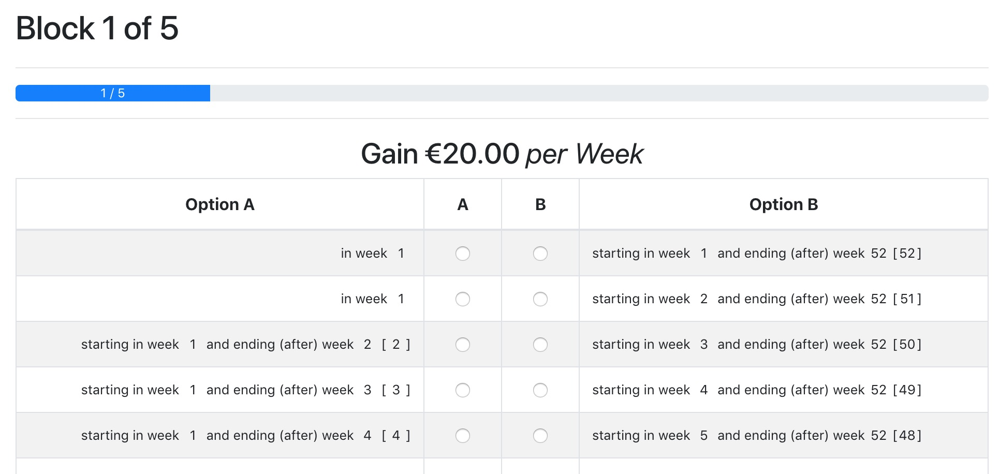
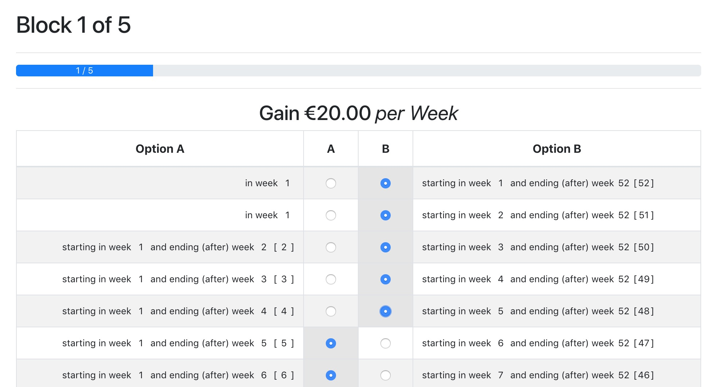
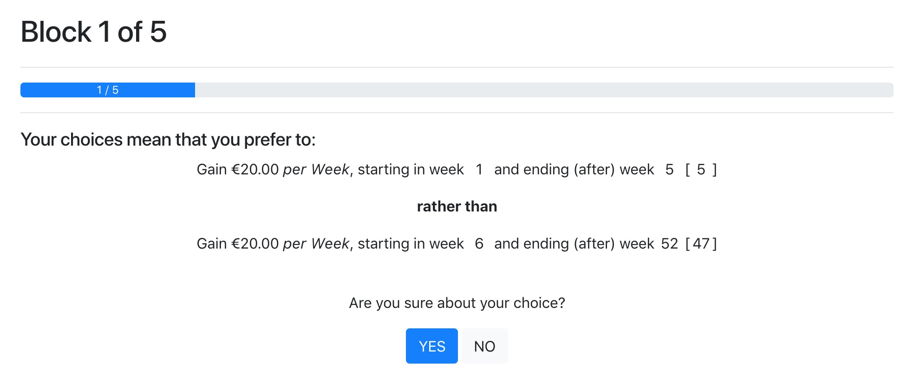

# otdm - Direct Method for otree

otdm provides an easy way of creating experiments to measure the temporal discounting of money using the Direct Method (DM) [Attema et al., 2016] for [otree](http://www.otree.org) by just editing a single configuration file (see [`config.py`](./config.py)).

## Features

By editing [`config.py`](./config.py) you can easily generate an app in order to apply the Direct Method. The player will be presented with a total of five blocks with multiple choices of preference each as shown below:

Selecting one option will automatically set the other radio buttons correctly:

Before really advancing to the next block the user will be faced with a confirmation message in order to affirm his selection:

Introduction to Naming rules of Choice List:
Multiple questions by varying:\
• the time difference between today and future: 15 days , 1 month ....\
• the amount of future payment: $20, $30...\
• both payments are delayed (future-future): like in 15 days vs. in 30 days.\
• days vs date\
8 categories: \
1_15days, $20, i-f\
2_30days, $20, i-f\
3_15days, $30, i-f\
4_30days, $30, i-f\
5_15days, $20, f-f\
6_30days, $20, f-f\
7_15days, $30, f-f\
8_30days, $30, f-f\
2 types:\
0_days, 1_date\
2 further treatment:\
none_control group, l_left, s_front size\
example: 51l: 15days, $20, f-f, date, left
